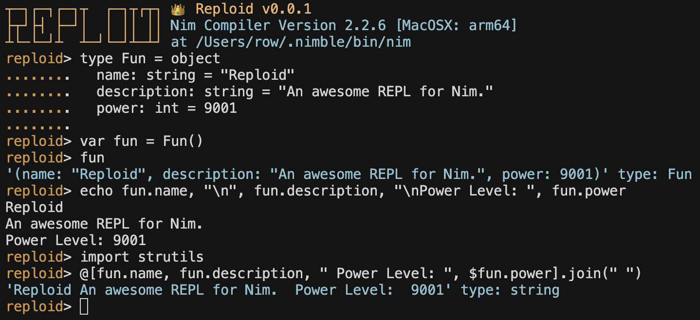

# Reploid: a Nim REPL

Reploid is a Nim REPL originally forked from [INim](https://github.com/inim-repl/INim), however the code has been rewritten from scratch, trying to keep the most useful features, and fixing the most shortcommings.

INim simulated the REPL behavior by re-running all the previous commands each time, and hiding the output of previous commands. Reploid instead runs each command just once by using its own virtual machine to keep track of the state.




## Features

### Already implemented
- Tested on Linux, MacOS, BSD and Windows
- It is available to be used as a CLI tool or as a library to integrate into other applications.
- Run it with a single call to `reploid()`, or build your own `REPL` using the nuts and bolts provided by the library.
- Automatic indentation (`if`, `for`, `proc`, `var`, ...)
- Offers preloading imports through the command line or configuration file.
- Command history support
- Uses `nim` compiler in PATH, or a custom path. 
- Can be configured through command line arguments or a configuration file.
- Setup one or more pre-imported preludes.
- Prints out value and type of expressions.
- Runs in the current directory, `import` global modules, or modules relative to the current directory.
- Colorized output
- Nim compiler options can be specified with the `--flags` option (ie: `reploid --flags=DEBUG,ssl`)


## Documentation

### Configurations and arguments
- **nim**: path to the nim compiler, default is just `nim`
- **welcome**: enable/disable the welcome message, enabled by default
- **flags**: comma separated list of flags to pass to the nim compiler
- **config**: configuration file to use, default is ~/.reploid/config
- **history**: history file to use, default is ~/.reploid/history
- **colors**: enabel/disable colors, enabled by default
- **help**: show the help message

## Built-in commands
 - **imports**: shows all imports
 - **declarations**: shows all type and proc declarations
 - **quit**: quits reploid
 - **help**: show this help message

### Quick start
From the command line:
```bash
nimble install https://github.com/RowDaBoat/reploid.git
reploid
```

On your nim code:
```nim
import reploid
reploid.reploid()
```

### API Reference
The full API reference is available [here](https://rowdaboat.github.io/reploid/reploid.html)


## Limitations
- **Compilation times**: since `reploid`'s vm uses `nim`'s compiler to compile commands and declarations it takes some time to run each. This could be mitigated by a faster compiler like `tcc`, but `tcc` has not yet implemented inline assembly for the `arm64` architecture, which is needed to compile `nim` on `MacOS`. Once `tcc` implements this, it will be integrated into `reploid`.

- **Declared procs cannot access variable declarations**: due to how the vm lays out procs and variable declarations, they cannot be accessed from procs. This design decision was taken to avoid greater compilation times.
